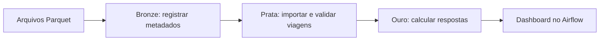

# WeCogno — Engenharia de dados: táxis de Nova York

## 1. Objetivo e requisitos atendidos

Este projeto processa os 12 arquivos Parquet de viagens de táxi amarelo de 2022, com Apache Airflow e PostgreSQL em Docker. A solução mantém metadados na bronze, importa as viagens na prata e publica as perguntas e respostas na ouro, consultadas por um dashboard dentro do Airflow.

O [enunciado original](https://github.com/datarisk-io/data-engineering-challenge) solicita configuração em Docker, ETL no Airflow, armazenamento no PostgreSQL e documentação das decisões, respostas e consultas SQL. A entrega deve estar em `challenge/`, em um fork pessoal.

| Requisito | Implementação |
| --- | --- |
| Airflow e PostgreSQL em Docker | `docker-compose.yml` e `Dockerfile` |
| ETL com os arquivos de táxi | DAG `taxi_nova_york_2022` e módulos `dags/etl/` |
| Persistência no PostgreSQL | Banco `taxi`, schemas bronze, prata e ouro |
| Quatro respostas e SQLs | Seção 9 e `sql/perguntas.sql` |
| Processo e decisões documentados | Este README |
| Consulta visual | Dashboard no Airflow e Adminer |

## 2. Tecnologias e estrutura do projeto

| Componente | Configuração |
| --- | --- |
| Apache Airflow | 2.11.0, Python 3.12, LocalExecutor |
| PostgreSQL | 16.8 |
| Leitura dos Parquet | PyArrow 19.0.1 |
| Conexão e COPY | Psycopg 3.2.6 |
| Adminer | Imagem fixada pelo digest no Compose |
| Orquestração | Docker Compose |

```text
data-engineering-challenge/
├── README.md
└── challenge/
    ├── README.md
    ├── nyc-tlc-data/
    │   └── yellow_tripdata_2022-01.parquet.gz ... 12 meses
    ├── Dockerfile
    ├── docker-compose.yml
    ├── dags/
    │   ├── dag_taxi.py
    │   └── etl/
    │       ├── __init__.py
    │       ├── banco.py
    │       ├── bronze.py
    │       ├── prata.py
    │       └── ouro.py
    ├── sql/
    │   ├── inicializacao.sql
    │   ├── estrutura.sql
    │   └── perguntas.sql
    └── plugins/
        ├── painel_perguntas.py
        └── templates/
            └── painel_perguntas.html
```

`dag_taxi.py` define as dependências. `banco.py` centraliza conexão e estrutura; `bronze.py` cadastra arquivos; `prata.py` importa e valida viagens; `ouro.py` executa as consultas e publica as respostas. O plugin disponibiliza o dashboard. Os nomes definidos pelo projeto estão em português; as chaves originais dos Parquet permanecem preservadas.

## 3. Fluxograma do processamento



O Airflow coordena todo o ETL: a bronze registra os arquivos, a prata importa e valida as viagens, e a ouro calcula e armazena as respostas para o dashboard. O GitHub renderiza o fluxograma diretamente no README.

A ordem das tarefas da DAG é:

```text
preparar_estrutura → registrar_bronze → ingerir_prata [12 arquivos]
                                       ↓
                                validar_prata → publicar_ouro
```

São **16 instâncias de tarefas**: quatro tarefas únicas e 12 ingestões. As ingestões podem ocorrer em paralelo, com até seis tarefas simultâneas. A validação aguarda todos os arquivos; a publicação só ocorre depois dela. A DAG não tem agenda automática: cada execução é disparada manualmente. Há uma execução ativa por vez e até duas novas tentativas por tarefa, com intervalo de um minuto.

## 4. Separação do banco em camadas

O PostgreSQL contém dois bancos: `airflow`, usado pelo orquestrador, e `taxi`, usado pelo ETL. Dentro de `taxi`, as camadas são **schemas**, permitindo consultar objetos como `prata.viagens_validas` na mesma conexão.

| Camada | Objeto | Responsabilidade |
| --- | --- | --- |
| Bronze | `bronze.arquivos` | Cadastro, origem, integridade e situação dos arquivos |
| Prata | `prata.viagens` | Todos os registros dos Parquet, com origem e linha |
| Prata | `prata.detalhes_viagens` | View dos campos originais com colunas em português |
| Prata | `prata.viagens_validas` | Tabela final de viagens usada nas respostas |
| Ouro | `ouro.perguntas_respostas` | Quatro perguntas, respostas, SQLs e atualização |

### 4.1. Bronze: metadados

Registra nome, URL da origem, caminho local, tamanho, SHA-256, número de registros, esquema do Parquet, data de cadastro e situação. Depois da importação, registra hash ingerido, quantidade ingerida e data de ingestão. A situação passa de `registrado` para `ingerido`.

A URL identifica a fonte; o ETL lê os arquivos locais de `challenge/nyc-tlc-data`, montados no contêiner. A bronze armazena metadados; os registros completos ficam na prata. As URLs originais e os nomes internos dos volumes existentes foram mantidos para preservar rastreabilidade e reutilizar os dados já carregados.

### 4.2. Prata: ingestão e qualidade

A importação usa COPY em lotes de 10 mil registros. `prata.viagens` possui nome do arquivo, número da linha, início, fim, distância e `dados_originais` em JSONB. Esse campo preserva os demais atributos de origem. A view `prata.detalhes_viagens` os apresenta como colunas em português, incluindo passageiros, locais de embarque e desembarque, tarifa, gorjeta e valor total.

Uma viagem entra em `prata.viagens_validas` quando:

1. O início está em 2022.
2. O fim é maior ou igual ao início e anterior a 2023.
3. A distância é finita e não negativa. Distância zero é aceita.

Os registros excluídos da análise continuam disponíveis em `prata.viagens`. As datas sem timezone são interpretadas no horário local de Nova York. Valores não finitos nos atributos JSON são representados por strings; a coluna tipada de distância mantém o valor original.

### 4.3. Ouro: resultados publicados

`ouro.perguntas_respostas` contém `id_pergunta`, `pergunta`, `resposta` em JSONB, `consulta_sql` e `data_atualizacao`. Há quatro linhas, uma por pergunta. A questão 3 guarda as cinco maiores viagens. A primeira resposta inclui o resumo da ingestão usado nos indicadores do painel.

As quatro respostas são publicadas na mesma transação. O dashboard lê essa publicação sem recalcular os milhões de viagens. Não são exportados arquivos JSON nem imagens pelo ETL.

## 5. Pré-requisitos

1. Instale e abra o Docker Desktop, com Docker Compose disponível.
2. Tenha Git e acesso à internet para obter o repositório e as imagens.
3. Disponibilize os 12 Parquet em `challenge/nyc-tlc-data/`. O Compose monta essa pasta em `/opt/airflow/data`, caminho usado pelo ETL por meio de `DIRETORIO_DADOS`.
4. Para a configuração com seis tarefas simultâneas, disponibilize 8 GB de RAM e 8 CPUs ao Docker. Em máquinas menores, reduza `max_active_tasks` para 1 ou 2 em `dags/dag_taxi.py`.
5. Reserve pelo menos 60 GB de disco. Na instância carregada, as tabelas da prata, com índices, ocupam aproximadamente 40 GB; o restante comporta imagens e WAL.

Os Parquet são os arquivos de entrada fornecidos pelo desafio, não dumps do banco nem resultados previamente calculados. O ETL extrai os registros desses arquivos e os carrega no PostgreSQL durante a execução. Depois da carga, o dashboard consulta o banco e não depende deles, mas novas execuções da DAG exigem os arquivos, inclusive para validar o SHA-256. Mantenha-os disponíveis para reproduzir a pipeline.

Apesar da extensão `.parquet.gz`, os arquivos têm cabeçalho `PAR1`: são Parquet com compressão interna. Não use `gunzip`.

Confira o ambiente:

```sh
docker --version
docker compose version
```

## 6. Passo a passo para executar

### 6.1. Obter a solução

Clone o fork que contém esta solução. Substitua `SEU_USUARIO` pelo usuário responsável pelo fork:

```sh
git clone https://github.com/SEU_USUARIO/data-engineering-challenge.git
cd data-engineering-challenge/challenge
```

Se você já tem o projeto local, entre diretamente em `challenge/`. Todos os comandos Docker seguintes devem ser executados nessa pasta.

### 6.2. Primeira inicialização

Execute cada comando na ordem e aguarde sua conclusão:

```sh
docker compose build
docker compose up -d postgres
docker compose run --rm airflow-init
docker compose up -d scheduler webserver adminer
docker compose ps
```

O PostgreSQL cria o banco `taxi` e o usuário de leitura `consulta` na primeira inicialização do volume. `airflow-init` migra os metadados e cria o administrador `airflow`. A estrutura das camadas será criada pela primeira tarefa da DAG. Aguarde o servidor web iniciar antes de abrir o navegador.

### 6.3. Executar a pipeline pelo terminal

```sh
docker compose exec scheduler airflow dags unpause taxi_nova_york_2022
docker compose exec scheduler airflow dags trigger taxi_nova_york_2022
```

A primeira execução importa todos os arquivos e pode demorar, dependendo dos recursos da máquina. Acompanhe o progresso no Airflow conforme a seção 7. Quando todas as tarefas terminarem com sucesso, abra ou recarregue o dashboard.

### 6.4. Ligar novamente um ambiente já inicializado

```sh
docker compose up -d postgres scheduler webserver adminer
```

Não é necessário recriar o usuário. Para executar novamente, repita o comando de disparo da seção 6.3. Arquivos com o mesmo SHA-256 já ingerido são ignorados, e as respostas são publicadas novamente.

### 6.5. Logs, reinício e parada

```sh
docker compose logs -f scheduler webserver
docker compose restart webserver
docker compose down
```

`logs -f` acompanha os serviços; use `Ctrl+C` para sair dos logs. Os logs específicos de cada tarefa ficam na interface do Airflow. Reinicie o webserver após alterar o Python do plugin. `down` para os serviços e preserva os volumes. Para migrar apenas os metadados em um ambiente existente:

```sh
docker compose run --rm airflow-init airflow db migrate
```

## 7. Acessar o Airflow e entender a aba Graph

### 7.1. Login e execução manual

1. Abra [http://localhost:8080](http://localhost:8080).
2. Entre com usuário `airflow` e senha `airflow`.
3. Na lista de DAGs, abra `taxi_nova_york_2022`.
4. Ative a chave da DAG se estiver pausada.
5. Clique em **Trigger DAG**, no botão de execução, e confirme o disparo.
6. Acompanhe a execução em **Grid** ou **Graph**.

### 7.2. Aba Graph: gráfico da pipeline

A aba **Graph** mostra as tarefas, suas dependências e o estado da execução selecionada. Cada bloco representa uma tarefa; as setas mostram a ordem em que ela pode executar. Selecione a execução que deseja acompanhar para não confundir seu estado com o de uma execução anterior.

A tarefa `ingerir_prata` é mapeada: o mesmo código recebe 12 nomes de arquivos. O grafo pode agrupá-la em um bloco, enquanto o painel de tarefas mapeadas permite inspecionar as 12 instâncias. Clique em uma instância para consultar detalhes e logs.

Use a legenda de estados da interface. `success` indica conclusão; `running`, execução; `failed`, falha; `up_for_retry`, nova tentativa pendente; `upstream_failed`, falha em uma dependência. O esperado ao final é que as 16 instâncias estejam em `success`.

A aba **Grid** facilita comparar execuções e localizar tarefas demoradas ou com falha. Graph representa a execução da pipeline; o dashboard de perguntas é acessado pelo menu **WeCogno → Perguntas e respostas**. Consulte também a [documentação da interface do Airflow 2.11](https://airflow.apache.org/docs/apache-airflow/2.11.0/ui.html).

### 7.3. Dashboard de perguntas e respostas

Abra [http://localhost:8080/perguntas-respostas/](http://localhost:8080/perguntas-respostas/) usando o mesmo login. O painel mostra indicadores, perguntas, respostas e unidades. A questão 3 exibe posição, dia e distância em Mi das cinco maiores viagens; a primeira linha tem outra cor e corresponde à resposta.

Depois de uma execução bem-sucedida, recarregue a página. A data de publicação é apresentada no horário de Brasília. Antes da primeira publicação, a página informa que ainda não existem respostas.

## 8. Acessar o Adminer e consultar o PostgreSQL

### 8.1. Login no Adminer

1. Abra [http://localhost:8081](http://localhost:8081).
2. Preencha os campos abaixo e clique em **Entrar**.
3. No seletor **Esquema**, escolha `bronze`, `prata` ou `ouro`. O schema `public` não contém as tabelas da solução.
4. Clique em **selecionar** junto à tabela para visualizar registros ou em **Comando SQL** para executar consultas.

| Campo | Valor |
| --- | --- |
| Sistema | PostgreSQL |
| Servidor | `postgres` |
| Usuário | `consulta` |
| Senha | `consulta` |
| Base de dados | `taxi` |

O usuário `consulta` possui somente leitura nas camadas. Para visualizar as respostas:

```sql
SELECT id_pergunta, pergunta, resposta, consulta_sql, data_atualizacao
FROM ouro.perguntas_respostas
ORDER BY id_pergunta;
```

Para conferir os arquivos:

```sql
SELECT nome_arquivo, quantidade_registros, quantidade_ingerida,
       situacao, data_ingestao
FROM bronze.arquivos
ORDER BY nome_arquivo;
```

Para consultar viagens sem carregar toda a tabela na interface:

```sql
SELECT * FROM prata.detalhes_viagens LIMIT 20;
```

### 8.2. Acesso pelo terminal ou outro cliente

```sh
docker compose exec postgres psql -U consulta -d taxi
```

No `psql`, execute SQL terminado em `;` e use `\q` para sair. Em um cliente instalado no computador, use host `localhost`, porta `55432`, banco `taxi`, usuário `consulta` e senha `consulta`. No Adminer, use servidor `postgres`, porque ele se conecta pela rede interna do Docker.

As credenciais documentadas pertencem ao ambiente local de demonstração. As portas do Compose ficam vinculadas a `127.0.0.1`.

## 9. Respostas do desafio e consultas SQL

As respostas abaixo usam `prata.viagens_validas` como tabela final. Todos os registros de origem permanecem em `prata.viagens`. As consultas reproduzem `sql/perguntas.sql`.

### 9.1. Total de registros na tabela final

**Resposta: 39.641.339 viagens.**

```sql
SELECT count(*) AS total_registros FROM prata.viagens_validas;
```

### 9.2. Viagens iniciadas e finalizadas em 17 de junho

**Resposta: 123.834 viagens em 17/06/2022.**

```sql
SELECT count(*) AS total_viagens FROM prata.viagens_validas
WHERE data_hora_inicio >= '2022-06-17' AND data_hora_inicio < '2022-06-18'
AND data_hora_fim >= '2022-06-17' AND data_hora_fim < '2022-06-18';
```

### 9.3. Dia da viagem mais longa percorrida

**Resposta: 28/10/2022, com 389.678,46 Mi.**

A consulta traz as cinco maiores distâncias. A primeira linha responde à pergunta; as demais permitem comparação.

| Posição | Dia | Distância (Mi) |
| --- | --- | --- |
| **1** | **28/10/2022** | **389.678,46** |
| 2 | 15/05/2022 | 357.192,65 |
| 3 | 15/02/2022 | 348.798,53 |
| 4 | 19/05/2022 | 344.408,48 |
| 5 | 03/05/2022 | 333.632,96 |

```sql
SELECT data_hora_inicio::date AS dia_viagem, data_hora_inicio, data_hora_fim,
distancia_milhas, nome_arquivo, numero_linha
FROM prata.viagens_validas
ORDER BY distancia_milhas DESC, data_hora_inicio, nome_arquivo, numero_linha
LIMIT 5;
```

### 9.4. Estatísticas da distância percorrida

| Estatística | Valor em Mi |
| --- | --- |
| Média | 5,959403 |
| Desvio padrão populacional | 599,302233 |
| Mínimo | 0,000000 |
| Máximo | 389.678,460000 |
| Primeiro quartil — 25% | 1,100000 |
| Mediana — 50% | 1,900000 |
| Terceiro quartil — 75% | 3,560000 |
| Desvio padrão amostral, complementar | 599,302240 |

```sql
WITH estatisticas AS (
 SELECT avg(distancia_milhas) AS media,
 stddev_pop(distancia_milhas) AS desvio_padrao_populacional,
 stddev_samp(distancia_milhas) AS desvio_padrao_amostral,
 min(distancia_milhas) AS minimo,
 max(distancia_milhas) AS maximo,
 percentile_cont(ARRAY[0.25,0.5,0.75]) WITHIN GROUP (ORDER BY distancia_milhas) AS quartis
 FROM prata.viagens_validas
)
SELECT media, desvio_padrao_populacional, desvio_padrao_amostral, minimo, maximo,
quartis[1] AS primeiro_quartil, quartis[2] AS mediana, quartis[3] AS terceiro_quartil
FROM estatisticas;
```

## 10. Decisões, integridade e validação

### 10.1. Critérios da análise

A tabela final considera viagens válidas de 2022 pelas regras da seção 4.2. A pergunta de 17 de junho exige início e fim dentro desse dia, usando intervalo fechado no começo e aberto no fim. Viagem mais longa significa maior distância, e não duração. O top 5 é ordenado por distância decrescente, com desempate por início, arquivo e linha.

O desvio padrão populacional é a resposta principal por descrever o conjunto analisado. O amostral é publicado como complemento. Os quartis usam `percentile_cont`, com interpolação contínua. Valores extremos foram preservados porque não há um limite de distância especificado no desafio; eles influenciam a média e o desvio padrão. O máximo é um valor anômalo de origem, mantido como registrado.

### 10.2. Reexecução e transações

O SHA-256 cadastrado deve corresponder ao arquivo antes da ingestão. Um arquivo já ingerido com o mesmo hash é ignorado. Se houver alteração, seus registros são substituídos na prata, junto com a atualização dos metadados, em uma transação. Falhas provocam rollback. O bloqueio por arquivo impede duas importações simultâneas do mesmo arquivo.

Cada linha é identificada por arquivo e posição, começando em 1. Registros iguais em posições distintas são preservados. Os dados das viagens não são enviados por XCom. A reconciliação compara as contagens esperadas, ingeridas e presentes na prata antes de publicar a ouro.

### 10.3. Resultados conferidos

| Conferência | Quantidade |
| --- | --- |
| Arquivos ingeridos | 12 |
| Registros importados | 39.656.098 |
| Viagens válidas | 39.641.339 |
| Registros excluídos da análise | 14.759 |
| Perguntas publicadas na ouro | 4 |

A execução `validacao_etl_modular` concluiu as 16 instâncias com sucesso. As respostas principais foram comparadas com leitura independente dos Parquet em DuckDB 1.4.3: contagens e quartis coincidiram; as estatísticas de ponto flutuante usaram tolerâncias relativa de 1e-10 e absoluta de 1e-8. O top 5 e a renderização do painel foram conferidos após as alterações. Esses registros descrevem a validação realizada durante o desenvolvimento; o projeto não inclui uma suíte de testes automatizados.

## 11. Problemas comuns

| Situação | O que verificar |
| --- | --- |
| Airflow ainda não abre | Aguarde a inicialização e consulte `docker compose logs webserver` |
| DAG não aparece | Confira o volume de `dags/` e execute `docker compose exec scheduler airflow dags list-import-errors` |
| Ingestão falhou | Abra os logs da instância mapeada; confira arquivo, memória e disco |
| Adminer mostra schema vazio | Selecione bronze, prata ou ouro, em vez de public |
| Dashboard sem respostas | Execute a DAG e aguarde `publicar_ouro` concluir |
| Dashboard mostra publicação anterior | Aguarde a execução terminar e recarregue a página |
| Usuário airflow já existe | Não repita a criação; use os comandos para ambiente inicializado |
| Porta ocupada | Confira 8080, 8081 e 55432; ajuste o mapeamento no Compose se necessário |

Variáveis da aplicação: `CONEXAO_TAXI` configura o banco, `DIRETORIO_DADOS` indica os Parquet e `URL_ORIGEM_DADOS` pode alterar a URL-base registrada na bronze. Os volumes persistem o PostgreSQL e os logs do Airflow.
